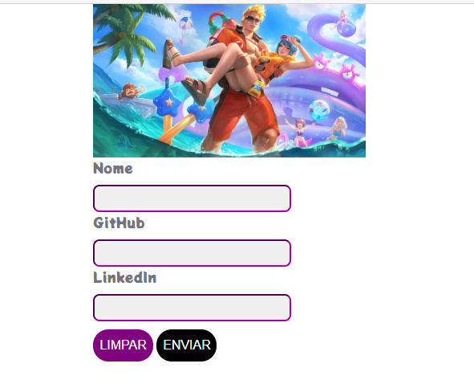
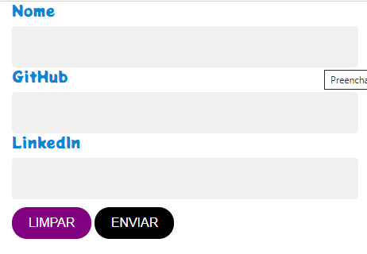

<h1 align=center>Form Life Guard :rose:</h1>
<h2 align=center>
 Do que se trata? 
</h2>

 <h3>Esse é mais um projeto simples com HTML CSS e JS e sua finalidade é ter um formulário que não tenha os dados perdidos ao recarregar a página, como geralmente acontece na web.</h3>

<h2 align=center>Telas</h2>

    
    

<h4 align=center>YouTube</h4>

 

 
# Tecnologias e frameworks
## Front end :memo:
- HTML
- CSS
- Javascript
- BOOTSTRAP 4

# Como executar o projeto
## Clonar o repositório na sua máquina. 
#### Em seguida startar a aplicação no clicando dublo em index.html 
# Autor
Lazaro Jose da Silva de Souza  
Estudante de Análise e Desenvolvimento de Sistemas pela UNINABUCO na modalidade EAD 
Entusiasta na arte de aprender algo do zero 
https://www.linkedin.com/in/lazarok09
## Aprenda a usar o [markdown](https://docs.pipz.com/central-de-ajuda/learning-center/guia-basico-de-markdown#open) no seu GitHub
## Use [emojis](https://github.com/ikatyang/emoji-cheat-sheet) no seu readme :P

< / :heart: >
